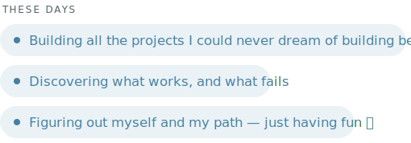
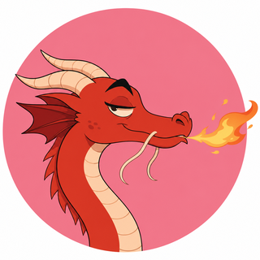

<picture>
  <source media="(prefers-color-scheme: dark)" srcset="./assets/hi-dark.svg">
  
</picture>

Half AI, half factory floor, zero pretending I have it all sorted. I spent a PhD and 7+ years helping factories stop wasting time, money and sanity — then took a giant left-turn into AI product management. Now I build AI that has to survive a real factory floor, not just look good in a slide deck.

<picture>
  <source media="(prefers-color-scheme: dark)" srcset="./assets/these-days-dark.svg">
  
</picture>

  

  

  

<b>Mushu</b>, my AI sidekick, read this and — reluctantly — gave it a 

